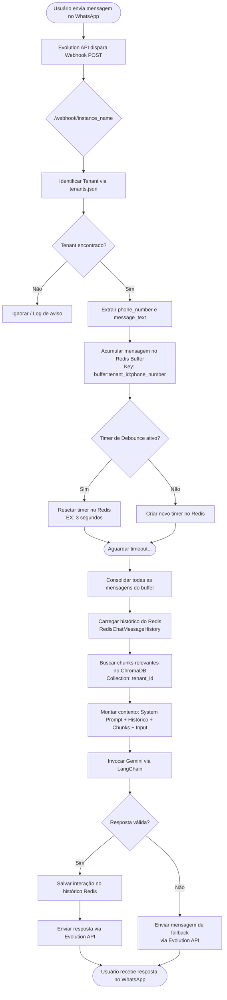
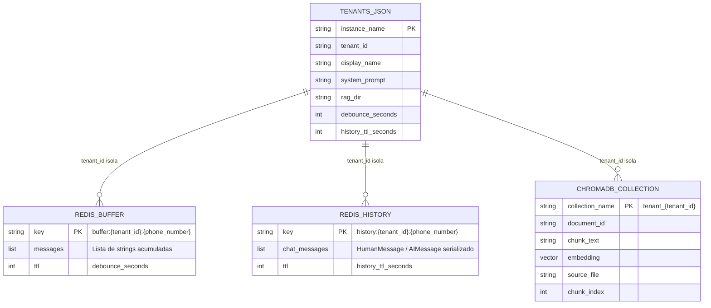

# PRD — WhatsBoot: Bot as a Service para WhatsApp

> **Versão:** 1.1.0
> **Data:** 2026-04-08
> **Status:** Em andamento — baseline single-tenant implementado, refatoração Multi-Tenant/Gemini pendente

> **Legenda do progresso:** `[x]` = Concluído | `[ ]` = Pendente
> **Nota:** O código atual implementa uma versão single-tenant com OpenAI. As tarefas pendentes representam a migração para a arquitetura Multi-Tenant com Google Gemini conforme especificado neste PRD.

---

## 1. Visão Geral

### 1.1 Sobre o Produto

WhatsBoot é um sistema **Multi-Tenant de Bot as a Service (BaaS)** para WhatsApp, construído com Python e FastAPI. Ele permite que múltiplos clientes (tenants) disponibilizem um assistente inteligente no WhatsApp capaz de responder perguntas com base em documentos próprios (PDFs e TXTs), utilizando **Retrieval-Augmented Generation (RAG)** com o modelo Google Gemini orquestrado pelo LangChain.

O sistema não possui interface web. Toda a interação com o usuário final ocorre **exclusivamente via WhatsApp**, através da Evolution API e seus Webhooks. A gestão de estado, histórico de conversas e o sistema de debounce de mensagens são centralizados no **Redis**. O banco vetorial é o **ChromaDB**, com isolamento por collection por tenant.

---

### 1.2 Propósito

Democratizar o acesso a assistentes conversacionais inteligentes baseados em documentos, permitindo que pequenas e médias empresas — como clínicas, oficinas, escritórios e comércios — ofereçam atendimento automatizado no WhatsApp com base em seu próprio conhecimento documentado, sem necessidade de infraestrutura complexa ou equipe de TI.

---

### 1.3 Público-Alvo

| Perfil | Descrição |
|---|---|
| **Tenant (Cliente B2B)** | Empresas ou profissionais que contratam o WhatsBoot para automatizar o atendimento via WhatsApp. Ex: clínicas médicas, oficinas mecânicas, escritórios de contabilidade. |
| **Usuário Final (B2C)** | Clientes dos tenants que interagem com o bot via WhatsApp para tirar dúvidas, obter informações ou realizar consultas. |
| **Operador do Sistema** | Desenvolvedor ou DevOps responsável pela hospedagem, configuração de instâncias e ingestão de documentos. |

---

### 1.4 Objetivos

1. Prover um sistema BaaS multi-tenant funcional, assíncrono e de baixa complexidade operacional.
2. Isolar completamente os dados (documentos, histórico, configurações) de cada tenant.
3. Implementar um pipeline RAG eficiente que utilize os documentos do tenant para fundamentar as respostas da IA.
4. Garantir design conversacional adequado para WhatsApp: respostas curtas, precisas e amigáveis ao celular.
5. Controlar o consumo de tokens com um sistema de debounce que agrupe mensagens consecutivas antes de acionar a IA.
6. Manter o projeto sem over-engineering: arquitetura flat, código simples, assíncrono e testável.

---

## 2. Requisitos Funcionais

### RF-01 — Recebimento de Webhook
O sistema deve expor um endpoint HTTP `POST /webhook/{instance_name}` que receba eventos da Evolution API e identifique o tenant pelo parâmetro `instance_name`.

### RF-02 — Roteamento Multi-Tenant
O sistema deve carregar o arquivo `tenants.json` e, com base no `instance_name` recebido no webhook, recuperar as configurações do tenant correspondente (nome, diretório de documentos, prompt de sistema).

### RF-03 — Debounce de Mensagens
O sistema deve implementar um mecanismo de debounce no Redis: ao receber uma mensagem, ela é acumulada em uma lista no Redis por um intervalo configurável (padrão: 3 segundos). Após o timeout sem novas mensagens, o conteúdo acumulado é consolidado e enviado ao pipeline RAG como um único input.

### RF-04 — Histórico de Conversas
O sistema deve manter o histórico de mensagens de cada conversa (identificada por `tenant_id + phone_number`) no Redis com TTL configurável, utilizando `RedisChatMessageHistory` do LangChain.

### RF-05 — Pipeline RAG
O sistema deve recuperar chunks relevantes do ChromaDB (collection do tenant) e injetá-los no contexto do LLM (Gemini), junto ao histórico de conversa, para gerar uma resposta fundamentada nos documentos do cliente.

### RF-06 — Envio de Resposta ao WhatsApp
O sistema deve enviar a resposta gerada pela IA de volta ao usuário via Evolution API, utilizando o número de telefone extraído do webhook.

### RF-07 — Ingestão de Documentos
O sistema deve fornecer um mecanismo de ingestão (script ou endpoint interno) capaz de ler PDFs e TXTs do diretório `rag_files/{tenant_id}/`, processar em chunks, gerar embeddings com Gemini e persistir no ChromaDB na collection isolada do tenant.

### RF-08 — Fallback de Erro da IA
Caso o pipeline RAG falhe ou retorne uma resposta inválida, o sistema deve enviar uma mensagem de fallback humanizada ao usuário e registrar o erro em log.

### RF-09 — Isolamento de Tenant
Os dados de cada tenant (collection do ChromaDB, chaves do Redis, diretório de documentos) devem ser estritamente isolados pelo `tenant_id`. Nenhum tenant deve ter acesso aos dados de outro.

### RF-10 — Configuração via Arquivo
A configuração dos tenants (nome, instância, prompt, diretório) deve ser gerenciada via `tenants.json`, sem necessidade de banco relacional.

---

## 3. Fluxograma — Webhook, Debounce e RAG



---

## 4. Requisitos Não-Funcionais

| ID | Requisito | Detalhe |
|---|---|---|
| RNF-01 | **Assincronicidade** | Todo o código deve ser `async/await`. Chamadas à Evolution API, Redis e ChromaDB devem ser não-bloqueantes. |
| RNF-02 | **Escalabilidade Horizontal** | O sistema deve ser stateless entre requisições. O estado é mantido exclusivamente no Redis. |
| RNF-03 | **Baixa Latência** | O tempo de resposta percebido pelo usuário (do envio à resposta) deve ser inferior a 8 segundos em condições normais. |
| RNF-04 | **Isolamento de Tenant** | Falhas em um tenant não devem afetar outros. Exceções devem ser capturadas por tenant. |
| RNF-05 | **Simplicidade de Código** | Arquitetura flat, sem camadas desnecessárias. Máximo de abstração útil. |
| RNF-06 | **Observabilidade** | Logs estruturados com `tenant_id`, `phone_number` e `request_id` em cada entrada relevante. |
| RNF-07 | **Confiabilidade do Redis** | TTL configurável para histórico (padrão: 24h) e buffer de debounce (padrão: 3s). |
| RNF-08 | **Segurança Básica** | O endpoint de webhook deve validar um token secreto via header para evitar requisições não autorizadas. |
| RNF-09 | **Portabilidade** | O sistema deve rodar inteiramente via `docker-compose`, sem dependências externas além das declaradas. |
| RNF-10 | **Padrões de Código** | Python com PEP8, type hints obrigatórios, aspas simples, código em inglês, comentários funcionais em inglês. |

---

## 5. Arquitetura Técnica

### 5.1 Stack

| Camada | Tecnologia | Função |
|---|---|---|
| **Web Framework** | FastAPI | Recebimento de webhooks, injeção de dependências, roteamento |
| **LLM & Embeddings** | Google Gemini (via `langchain-google-genai`) | Geração de respostas e vetorização de documentos |
| **Orquestração de IA** | LangChain | Chain de RAG, gerenciamento de histórico, retriever |
| **Mensageria** | Evolution API (via HTTP + Webhooks) | Integração com WhatsApp |
| **Cache & Estado** | Redis | Debounce, histórico de conversas (TTL), sessões |
| **Banco Vetorial** | ChromaDB (SQLite local) | Armazenamento e busca de embeddings por tenant |
| **Containerização** | Docker + Docker Compose | Orquestração de todos os serviços |
| **Config de Tenants** | `tenants.json` | Mapeamento de instâncias para configurações de tenant |

---

### 5.2 Estrutura de Dados — Schemas e Isolamento Multi-Tenant



**Isolamento por tenant no Redis:**
```
buffer:clinica_a:5511999990001   → buffer de mensagens do usuário (debounce)
history:clinica_a:5511999990001  → histórico de conversa do usuário
buffer:oficina_b:5511888880002   → completamente separado
history:oficina_b:5511888880002  → completamente separado
```

**Isolamento por tenant no ChromaDB:**
```
Collection: tenant_clinica_a   → embeddings dos documentos da Clínica A
Collection: tenant_oficina_b   → embeddings dos documentos da Oficina B
```

---

## 6. Design Conversacional

> O WhatsBoot substitui o conceito de Design System visual por **Design Conversacional**, definindo as regras de como o bot se comunica.

### 6.1 Tom de Voz

| Atributo | Regra |
|---|---|
| **Idioma** | Sempre Português Brasileiro (pt-BR), independente do idioma do usuário. |
| **Formalidade** | Amigável e profissional. Nem robotizado, nem informal demais. Tratar como "você". |
| **Objetividade** | Respostas diretas ao ponto. Evitar rodeios, introduções longas ou repetição da pergunta. |
| **Empatia** | Em casos de frustração ou reclamação do usuário, iniciar com uma frase de acolhimento breve antes da resposta. |

### 6.2 Limites e Formatação

| Regra | Detalhe |
|---|---|
| **Tamanho de resposta** | Máximo de 3 parágrafos curtos por mensagem. Preferir 1–2. |
| **Emojis** | Máximo de 1 emoji por mensagem, apenas se contextualmente relevante. Evitar em respostas técnicas ou de erro. |
| **Listas** | Usar listas com hífens (`-`) em vez de bullets ou markdown complexo. WhatsApp renderiza mal formatações avançadas. |
| **Negrito** | Usar `*texto*` apenas para destacar informações críticas (horário, valor, nome de serviço). |
| **Links** | Enviar links limpos, sem encurtadores desconhecidos. |
| **Saudação** | Não repetir saudações a cada mensagem. Apenas no início da conversa (primeiro contato ou após 24h de inatividade). |

### 6.3 Tratamento de Erros de IA e Alucinações

| Situação | Comportamento |
|---|---|
| **Informação não encontrada nos documentos** | O bot deve responder: *"Não encontrei essa informação nos materiais disponíveis. Posso te ajudar com outra dúvida?"* — nunca inventar dados. |
| **Alucinação detectável** | O prompt de sistema deve instruir o Gemini a responder apenas com base no contexto fornecido (RAG). Respostas fora do escopo devem ser bloqueadas pelo prompt. |
| **Falha técnica do pipeline** | Enviar mensagem de fallback: *"Tive um problema ao processar sua mensagem. Por favor, tente novamente em instantes."* |
| **Timeout da IA** | Se o Gemini não responder em X segundos (configurável), enviar fallback e logar o erro. |
| **Mensagem vazia ou incompreensível** | Responder: *"Desculpe, não entendi sua mensagem. Pode reformular?"* |

### 6.4 Exemplos de Respostas

**❌ Ruim:**
> "Olá! Seja muito bem-vindo ao atendimento virtual da Clínica A! Fico muito feliz em poder te ajudar hoje 😊🎉✨ Baseado nas informações que temos em nosso sistema, posso informar que o horário de funcionamento da nossa clínica é de segunda a sexta das 8h às 18h e aos sábados das 8h às 12h!!!"

**✅ Bom:**
> "O horário de atendimento é de segunda a sexta, das 8h às 18h, e sábados das 8h às 12h."

---

## 7. User Stories

### Épico 1 — Atendimento Conversacional via WhatsApp

| ID | User Story | Critérios de Aceite |
|---|---|---|
| US-01 | **Como usuário final**, quero enviar uma pergunta via WhatsApp e receber uma resposta precisa baseada nos documentos do tenant, para resolver minha dúvida sem ligar para o estabelecimento. | - Bot responde em menos de 8s. - Resposta fundamentada nos documentos do tenant. - Linguagem em pt-BR. |
| US-02 | **Como usuário final**, quero que o bot entenda o contexto de mensagens anteriores na mesma conversa, para não precisar repetir informações. | - Histórico mantido por no mínimo 24h. - Bot referencia contexto anterior quando relevante. |
| US-03 | **Como usuário final**, quero que, ao enviar várias mensagens rápidas seguidas, o bot as agrupe e responda de uma vez, para não receber múltiplas respostas fragmentadas. | - Bot agrupa mensagens enviadas em até 3s de intervalo. - Apenas uma resposta consolidada é gerada. |

### Épico 2 — Gestão de Tenants

| ID | User Story | Critérios de Aceite |
|---|---|---|
| US-04 | **Como operador**, quero adicionar um novo tenant no `tenants.json` e ingerir seus documentos, para que o sistema sirva um novo cliente sem downtime. | - Novo tenant funcional após edição do JSON e execução do script de ingestão. - Sem impacto nos tenants existentes. |
| US-05 | **Como operador**, quero que os dados de cada tenant sejam completamente isolados, para garantir privacidade e segurança entre clientes. | - Collections do ChromaDB separadas por tenant. - Chaves do Redis prefixadas por tenant_id. - Nenhum vazamento de dados entre tenants em testes. |

### Épico 3 — Confiabilidade e Observabilidade

| ID | User Story | Critérios de Aceite |
|---|---|---|
| US-06 | **Como operador**, quero que erros no pipeline de IA não derrubem o sistema e sejam logados com contexto, para diagnosticar problemas rapidamente. | - Exceções capturadas por tenant. - Log estruturado com tenant_id, phone, erro e traceback. - Mensagem de fallback enviada ao usuário. |
| US-07 | **Como operador**, quero subir toda a infra com um único comando `docker-compose up`, para facilitar o deploy e onboarding. | - Todos os serviços (Bot, Redis, Evolution API, Postgres) iniciam corretamente. - Healthchecks configurados. |

---

## 8. Métricas de Sucesso

### 8.1 KPIs de Produto

| KPI | Meta Inicial | Como Medir |
|---|---|---|
| Taxa de Resolução Autônoma | ≥ 70% das perguntas respondidas sem fallback | Log de respostas com fallback vs. total |
| Satisfação do Usuário (CSAT implícito) | Menos de 10% de mensagens do tipo "não entendi" ou repetição de pergunta | Análise de padrões no histórico Redis |
| Tempo de Onboarding de Tenant | < 30 minutos do zero ao primeiro atendimento funcional | Medição manual durante setup |

### 8.2 KPIs de Consumo de Tokens

| Métrica | Meta | Observação |
|---|---|---|
| Tokens por interação (média) | < 2.000 tokens | Monitorar via callback do LangChain |
| Redução por debounce | ≥ 20% de saving vs. sem debounce | Comparação em cenários de teste |
| Custo mensal estimado por tenant | < USD 5,00 (100 usuários ativos/dia) | Baseado em pricing do Gemini |

### 8.3 KPIs de Latência

| Etapa | Meta |
|---|---|
| Webhook → Buffer Redis | < 100ms |
| Debounce → Trigger do pipeline | 3s (configurável) |
| Retrieval ChromaDB | < 500ms |
| Gemini API (geração) | < 4s |
| **Latência total percebida** | **< 8s** |

---

## 9. Riscos e Mitigações

| Risco | Probabilidade | Impacto | Mitigação |
|---|---|---|---|
| Alucinação do Gemini fora do escopo RAG | Média | Alto | Prompt de sistema restritivo; instrução explícita de responder apenas com base no contexto. |
| Crescimento descontrolado do histórico Redis | Baixa | Médio | TTL configurável por tenant; monitoramento de memória Redis. |
| Colisão de chaves Redis entre tenants | Baixa | Alto | Prefixação estrita: `{tipo}:{tenant_id}:{phone}`. Testes de isolamento. |
| Lentidão na ingestão de PDFs grandes | Média | Baixo | Chunking assíncrono; ingestão offline/script separado. |
| Indisponibilidade da Evolution API | Baixa | Alto | Retry com backoff exponencial; log de falhas de envio. |
| Webhook não autenticado (ataque externo) | Média | Alto | Validação de token secreto via header em todos os endpoints. |
| ChromaDB corrompido (SQLite) | Baixa | Alto | Backup periódico do diretório `chroma_data/`; documentação de restore. |
| Debounce não disparando (bug de timer) | Média | Alto | Testes unitários do módulo `message_buffer.py`; TTL como failsafe. |

---


---

*PRD atualizado em 2026-04-08 | WhatsBoot v1.1.0 — baseline single-tenant implementado*